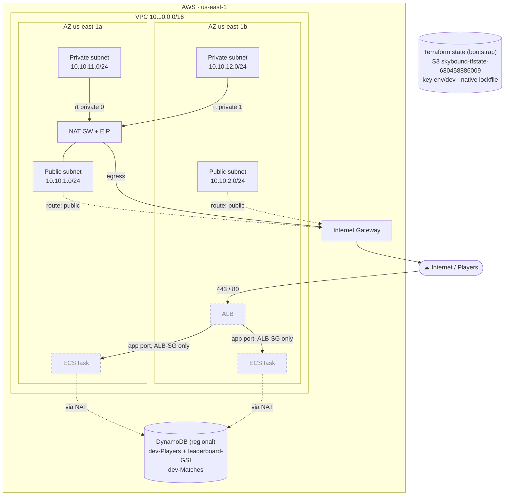

# Skybound Arena — Architecture
The reusable, multi-environment landing zone everything else deploys into. The
diagram below reflects the **dev** environment as currently applied.

> Solid nodes are deployed today. Dashed/grey nodes (ALB, ECS tasks) are
> declared — the security groups already exist — but are stood up in Project 2.

## How to read it

- **Security tiers** (the gaming story): players reach only the ALB on 443/80;
  the ALB is the *only* source the app tasks accept traffic from (ingress
  restricted to the ALB security group); the data tier has no inbound internet
  path at all.
- **Single NAT in dev**: both private route tables egress through one NAT
  gateway in AZ-a to save cost. Prod runs one NAT per AZ so a single-AZ failure
  can't sever the other AZ's outbound path. *(What I'd change for prod.)*
- **DynamoDB is a regional service outside the VPC**, reached via NAT egress
  today. A Gateway VPC Endpoint would keep that traffic off the NAT entirely —
  the prod upgrade.
- **State backend** is bootstrap infrastructure (created once, separately), not
  part of the dev VPC. It uses native S3 lockfile locking rather than a
  DynamoDB lock table.

## Per-environment model

`dev`, `staging`, and `prod` are **separate directories** calling the same
`modules/`, each with its own state key and `terraform.tfvars`. The module code
is identical across environments; only the values differ (CIDRs,
`nat_gateway_count`, PITR). That sameness is the point — it proves one-command
repeatability.
